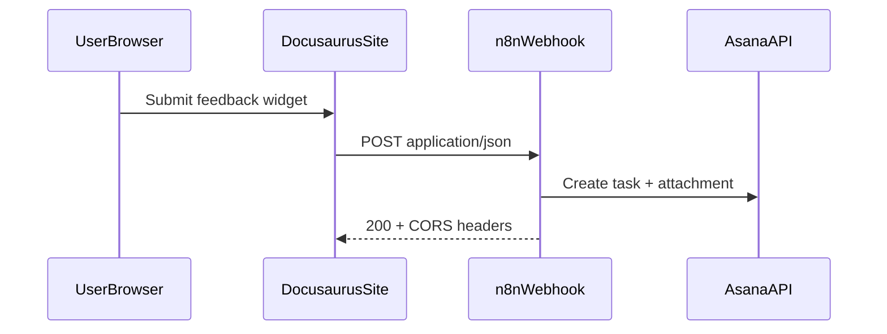

# Texter Docs — feedback widget → n8n → Asana

**Plan file:** `[.cursor/plans/docs-feedback-asana.plan.md](.cursor/plans/docs-feedback-asana.plan.md)`

## Architecture (chosen)

Browser **does not** hold the Asana token. The docs site `POST`s to your **n8n Webhook**; n8n creates the Asana task (and attachment). **No separate serverless service** beyond n8n you already run.

**Requirements on n8n:** production URL reachable from visitors; webhook responds with **CORS** for `https://whatsper.github.io` (and `http://localhost:3000` for local testing if desired).

## Payload (JSON)

The widget sends:

- `category`, `scope` (`page` | `general`), `pageUrl`, `pageTitle`, `sectionLabel`, `quotedText`, `message`, optional `contact`
- `screenshot`: `{ mime, base64 }` or `null`
- `website`: honeypot (must be empty)
- `submittedAt`: ISO timestamp

## Repo implementation

- `[src/theme/Layout/index.tsx](src/theme/Layout/index.tsx)` — wraps `@theme-original/Layout`, mounts widget
- `[src/components/DocFeedback/](src/components/DocFeedback/)` — UI + `fetch`
- `[docusaurus.config.ts](docusaurus.config.ts)` — `customFields.feedbackWebhookUrl` from `process.env.FEEDBACK_WEBHOOK_URL`
- `[.github/workflows/deploy-github-pages.yml](.github/workflows/deploy-github-pages.yml)` — pass secret into `npm run build`
- `[README.md](README.md)` — env + n8n notes

## Your follow-up (n8n + Asana)

- Webhook → parse JSON → Asana node: title, notes, project/section, assignee → if `screenshot`, add attachment (binary from base64).
- Put a **non-guessable token** in the webhook path or query if you want basic obscurity.
- Mute the Asana **project** or tune notifications to limit email noise.

