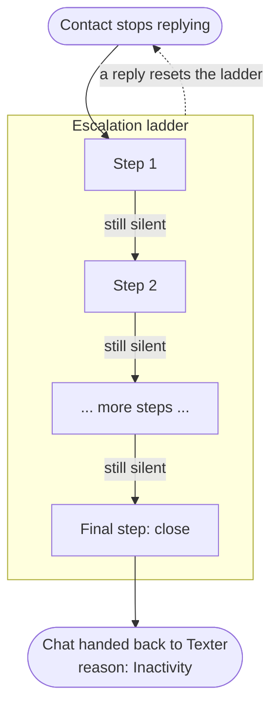

# Abandoned Bot System

The **Abandoned Bot System** is how the Q-AI Bot follows up when a contact goes quiet in the middle of a conversation. It is the re-engagement layer that decides *when* to nudge, *what* to say, and *when to give up*, so a stalled chat is nudged back or cleanly closed instead of going cold.

This behavior is driven by a background automation workflow called **AI Abandoned Bot**, which checks active AI conversations **every 4 minutes, between 8 AM and 9 PM**, and acts on any that have gone silent.

---

## The ladder concept

Each project has an **escalation ladder**: an ordered list of timed **steps**. The AI Abandoned Bot walks this ladder one step at a time, starting with the gentlest follow-up and escalating from there.



---

## Step modes

Every step has a **mode** that decides what happens when it fires:

| Mode | What it does |
| --- | --- |
| `text` | Sends a fixed, pre-written message. No AI involved. The exact text you configured is sent as-is. |
| `ai` | Runs a fresh AI re-engagement turn on the project's own model, so the nudge is phrased in context for this specific conversation. |
| `close` | Ends the AI session with the reason **Inactivity** and hands the chat back. |

:::info[The last step is always a close]
A ladder must end with a `close` step. This guarantees that a silent conversation eventually wraps up cleanly instead of nudging forever. See [Conversation Lifecycle](/docs/q-ai-bot/conversation-lifecycle) for what happens after the handoff.
:::

---

## How timing works

Each step has its own **delay**, measured **from the last event**: either the contact's most recent reply or the previous nudge sent. Delays are **incremental**, not cumulative from the start of the conversation.

For example, a ladder of "5 minutes, then 10 minutes" means:

- Step 1 fires 5 minutes after the contact's last message.
- Step 2 fires 10 minutes after step 1 was sent, so 15 minutes into the silence, not 10.

:::note[Nudges fire on a cycle, and pause overnight]
Because the check runs every 4 minutes within the 8 AM to 9 PM window, a nudge fires at the next check after its delay elapses (timing is approximate to within a few minutes, never to the second), and any step due outside that window waits until the window reopens the next morning. Design your delays with that in mind.
:::

:::caution[Total delay is capped at 12 hours]
The combined delay of all steps in a ladder cannot exceed **12 hours**. This is a platform rule: a ladder that adds up to more than 12 hours of waiting will be rejected. Design ladders that finish (reach their `close` step) within that window.
:::

---

## Reset on reply

The ladder is not a one-way trip. **Any reply from the contact restarts the ladder from the top.** The moment a new message comes in, the conversation is "active" again, the step counter goes back to the beginning, and timing is re-measured from that fresh reply.

So a contact can be nudged, reply, drift off again, and be nudged again: each silent stretch gets the full ladder.

---

## A note on cost

`text` steps are free to run: they just send a message you already wrote. `ai` steps are different:

:::caution[`ai` steps use model usage and count toward the conversation]
Every `ai` step runs a real turn on the project's model, so it **consumes model usage** and **counts as a message** in the conversation, the same way a normal AI reply does. If you want re-engagement without that cost, use `text` steps instead. Reserve `ai` steps for cases where a context-aware, personalized nudge is genuinely worth the spend.
:::

---

## The default ladder

Out of the box, every project starts with:

```json
[
  { "delay_mins": 5, "mode": "text", "msg": "היי, עדיין פה?" },
  { "delay_mins": 10, "mode": "close" }
]
```

The ladder is fully **configurable per project**: you can add more steps, change delays, swap in `ai` steps, and customize the text. See [Per-Project Settings](/docs/q-ai-bot/per-project-settings) for where the ladder lives and how to change it.

---

## A ladder with every mode

A ladder is an ordered list of steps. Each step has a `delay_mins` (minutes since the last event), a `mode`, and either a `msg` (for `text`) or a `prompt` (for `ai`); a `close` step needs neither:

```json
[
  { "delay_mins": 5,  "mode": "text",  "msg": "Hi, still there? Happy to keep helping whenever you're ready." },
  { "delay_mins": 15, "mode": "ai",    "prompt": "Write a short, friendly nudge that refers to what the contact last asked about and invites them to continue." },
  { "delay_mins": 30, "mode": "close" }
]
```

That sends a fixed reminder after 5 minutes of silence, a context-aware AI nudge 15 minutes after that, then closes the session (reason **Inactivity**) 30 minutes later. Delays are incremental and must total under the 12-hour cap.

---

## Related pages

- [Conversation Lifecycle](/docs/q-ai-bot/conversation-lifecycle): how a chat starts, runs, and is handed back to humans.
- [Per-Project Settings](/docs/q-ai-bot/per-project-settings): where the ladder and other per-project behavior are configured.
- [Q-AI Bot Overview](/docs/q-ai-bot/overview): how the whole system fits together.
