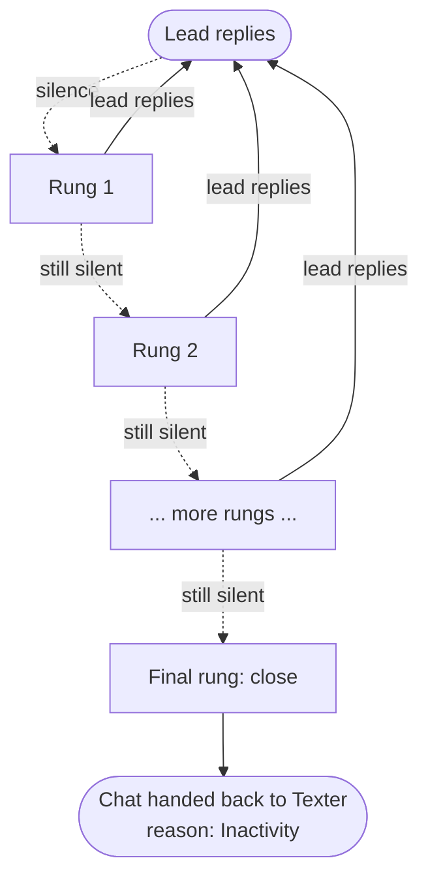

# Abandoned Bot System

The **Abandoned Bot System** is how the Q-AI Bot follows up when a lead goes quiet in the middle of a conversation. It is the re-engagement layer that decides *when* to nudge, *what* to say, and *when to give up* and hand the chat back.

This behavior is driven by a background automation workflow called **AI Abandoned Bot**, which checks active AI conversations on a regular cycle and acts on any that have gone silent.

---

## The problem it solves

When a lead stops replying mid-conversation, the chat stalls and goes cold. The Abandoned Bot System gives the project a structured, automatic way to nudge the person back, or to cleanly close the conversation if they aren't coming back.

---

## The ladder concept

Each project has an **escalation ladder**: an ordered list of timed **rungs**. The AI Abandoned Bot walks this ladder one rung at a time. The first rung is the gentlest follow-up; later rungs escalate; the final rung ends the conversation.

---

## Rung modes

Every rung has a **mode** that decides what happens when it fires:

| Mode | What it does |
| --- | --- |
| `text` | Sends a fixed, pre-written message. No AI involved — the exact text you configured is sent as-is. |
| `ai` | Runs a fresh AI re-engagement turn on the project's own model, so the nudge is phrased in context for this specific conversation. |
| `close` | Ends the AI session with the reason **Inactivity** and hands the chat back. |

:::info[The last rung is always a close]
A ladder must end with a `close` rung. This guarantees that a silent conversation eventually wraps up cleanly instead of nudging forever. The AI session is ended and the chat is returned to the Texter flow with the termination reason **Inactivity** — see [Conversation Lifecycle](/docs/q-ai-bot/conversation-lifecycle) for what happens after a handoff.
:::

---

## How timing works

Each rung has its own **delay**, and that delay is measured **from the last event** — either the lead's most recent reply or the previous nudge that was sent. Delays are **incremental**, not cumulative from the start of the conversation.

For example, a ladder of "5 minutes, then 10 minutes" means:

- Rung 1 fires 5 minutes after the lead's last message.
- Rung 2 fires 10 minutes after rung 1 was sent — so 15 minutes into the silence, not 10.

:::caution[Total delay is capped at 12 hours]
The combined delay of all rungs in a ladder cannot exceed **12 hours**. This is a platform rule: a ladder that adds up to more than 12 hours of waiting will be rejected. Design ladders that finish (reach their `close` rung) within that window.
:::

---

## Reset on reply

The ladder is not a one-way trip. **Any reply from the lead restarts the ladder from the top.**

The moment a new message comes in, the conversation is "active" again, the rung counter goes back to the beginning, and timing is re-measured from that fresh reply. If the lead goes quiet again later, the ladder starts over from rung 1.

This means a lead can be nudged, reply, drift off again, and be nudged again — each silent stretch gets the full ladder.

---

## A note on cost

`text` rungs are free to run — they just send a message you already wrote. `ai` rungs are different:

:::caution[`ai` rungs use model usage and count toward the conversation]
Every `ai` rung runs a real turn on the project's model, so it **consumes model usage** and **counts as a message** in the conversation, the same way a normal AI reply does. If you want re-engagement without that cost, use `text` rungs instead. Reserve `ai` rungs for cases where a context-aware, personalized nudge is genuinely worth the spend.
:::

---

## The default ladder

Out of the box, every project gets a simple, sensible ladder:

1. **A short text nudge** — one gentle follow-up message after a brief delay.
2. **A close** — if the lead is still silent, the session ends with reason **Inactivity**.

This mirrors the classic "one reminder, then give up" behavior and keeps things cheap (no `ai` rungs) and predictable.

The ladder is fully **configurable per project**: you can add more rungs, change delays, swap in `ai` rungs, and customize the text. See [Per-Project Settings](/docs/q-ai-bot/per-project-settings) for where the ladder lives and how to change it.

---

## Related pages

- [Conversation Lifecycle](/docs/q-ai-bot/conversation-lifecycle) — how a chat starts, runs, and is handed back to humans.
- [Per-Project Settings](/docs/q-ai-bot/per-project-settings) — where the ladder and other per-project behavior are configured.
- [Q-AI Bot Overview](/docs/q-ai-bot/overview) — how the whole system fits together.
