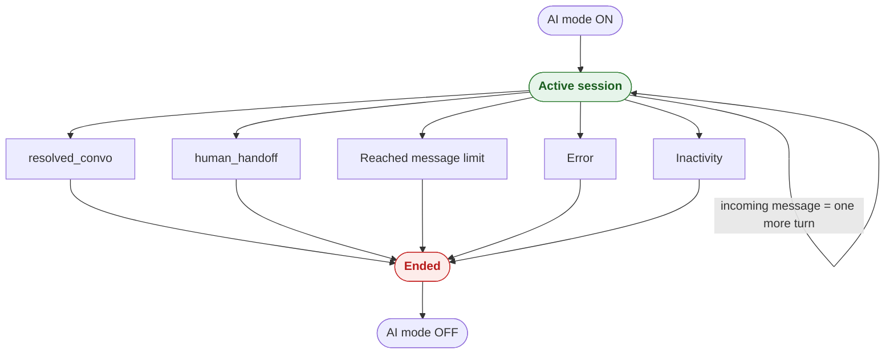

# Conversation Lifecycle

This page traces the full life of a Q-AI Bot **session** — how it starts, what happens on each turn, the five ways it ends, what handoff means, and how idle conversations are re-engaged — then a final **[Scenarios](#scenarios)** section covers the **Texter** wiring that connects the platform to the assistant. For the step-by-step of a single turn, see **[How It Works](/docs/q-ai-bot/how-it-works)**.

---

## Session start

A session begins when **AI mode is switched on** for a chat. At that point:

- A **fresh session** is created — no memory carries over from any earlier AI session on the same chat.
- The assistant receives the project's **system prompt** (its standing instructions and persona) and the recent chat history.
- The chat is now "owned" by the assistant: incoming messages will be answered by it until the session ends.

---

## Ongoing turns

While the session is open, **each incoming message is one AI turn**. The assistant retrieves from the **[knowledge base](/docs/q-ai-bot/knowledge-base)**, reasons, and returns a **[structured reply](/docs/q-ai-bot/response-schema)** whose visible part is sent to the contact. After each turn the session either stays open for the next message, or ends.

---

## The five ways a session ends

A session ends for one of **five** reasons. The reason is **recorded on the chat** so your Texter bot and your reports know *why* the assistant stepped away. The first four can happen during an active turn; the fifth comes from the re-engagement system when a chat goes quiet.

| End condition | Termination reason (concept) | Meaning |
| --- | --- | --- |
| **The model resolves the conversation** | `resolved_convo` | The assistant answered the contact's need and closed the chat itself. |
| **The model requests a human** | `human_handoff` | The assistant decided the conversation needs a person and escalated. |
| **The per-project message limit is reached** | `Reached message limit` | The session hit the maximum number of AI turns allowed for this project, so it ends to prevent endless loops. |
| **An error occurs during a turn** | `Error` | Something failed mid-turn. The session ends safely rather than leaving the contact with a stalled bot. |
| **The chat goes quiet for too long** | `Inactivity` | The re-engagement system ran out of follow-ups and closed the idle session (see [Idle re-engagement](#idle-re-engagement) below). |

:::info[Reasons are concepts, not error codes]
Treat the reasons above as named outcomes. Your Texter bot can branch on the recorded reason — for example, route a `human_handoff` to an agent, or send a different closing message after a `Reached message limit`. The **[Response Schema](/docs/q-ai-bot/response-schema)** page shows how the assistant emits the reason, and the **[AI Bot recipe](/docs/YAML/Bot%20Recipes/AI%20Bot)** shows a bot that branches on it.
:::

---

## What handoff means

"Handoff" is what happens at the end of **every** session, regardless of the reason: AI mode is switched **off** for the chat, and control returns to Texter. The recorded termination reason then drives what comes next:

- On **`human_handoff`**, the chat is routed to a human agent.
- On **`resolved_convo`**, the chat can simply be closed or labelled.
- On **`Reached message limit`**, **`Inactivity`**, or **`Error`**, your bot can send an appropriate closing message and decide whether to involve a person.

In other words, the assistant never silently disappears — it always switches off cleanly and leaves a reason behind for the bot to act on. Handoff ends the session rather than pausing it; if the conversation later needs the AI again, switching AI mode on starts a **brand-new session** (see [Session start](#session-start)).

---

## Idle re-engagement

What if the contact just stops replying mid-conversation? The session doesn't stay open forever. A separate **re-engagement system** watches for quiet chats and walks a per-project **ladder** of timed follow-ups — gentle nudges, and eventually a close.

When that system gives up and closes a quiet session, it ends the session with the **`Inactivity`** reason, exactly like any other handoff. The full behavior — the nudge ladder, the difference between a plain text nudge and an AI nudge, and how a reply resets the ladder — is on the **[Abandoned Bot System](/docs/q-ai-bot/abandoned-bot-system)** page.

---

## Scenarios

So far this page has described the **assistant's** side of the lifecycle. The **Texter** side is wired by **scenarios** — small, event-driven rules in your Texter environment that react to chat events and emit the signals the assistant responds to.

You don't have to build these from scratch. The Q-AI scenarios are published in the **Texter Scenario Marketplace**, ready to browse and import.

### The scenarios that drive the lifecycle

These three scenarios cover the core loop. Each one listens for a Texter event and turns it into a signal the assistant reacts to:

| Scenario | When it fires | What it does |
| --- | --- | --- |
| **Q-AI: Turn On AI Bot** | AI mode is switched on for a chat | Starts the AI session by forwarding the chat and its recent session messages to the assistant. |
| **Q-AI: Forward Incoming Message to AI** | A contact sends a message while AI mode is on | Forwards that message to the assistant as the next AI turn. |
| **Q-AI: End AI Session & Run Bot** | AI mode is switched off (with the chat still under the bot) | Ends the AI session and resumes the Texter bot from a designated node so your flow can act on the termination reason. |

In addition to these three, the suite includes scenarios that **switch AI mode off the moment a human takes over** — when an agent is assigned the chat, when it is resolved manually, when it moves to pending, or when a template message is sent — so the assistant steps aside instantly whenever a person steps in.

### Browsing and importing them

All Q-AI scenarios live in the marketplace under the **`ai-bot`** tag.

:::tip[Find them fast]
Open the **[Scenario Marketplace](/scenarios)** and type **`q-ai`** in the search box (or filter by the **`ai-bot`** tag). That surfaces the whole Q-AI suite — the three lifecycle scenarios above plus the human-takeover scenarios — each with a copy-pasteable example you can import into your Texter environment.
:::

:::note
To provision a brand-new project's assistant end to end, use the **[Onboard AI Bot tool](/docs/tools/onboard-ai-bot)**.
:::
