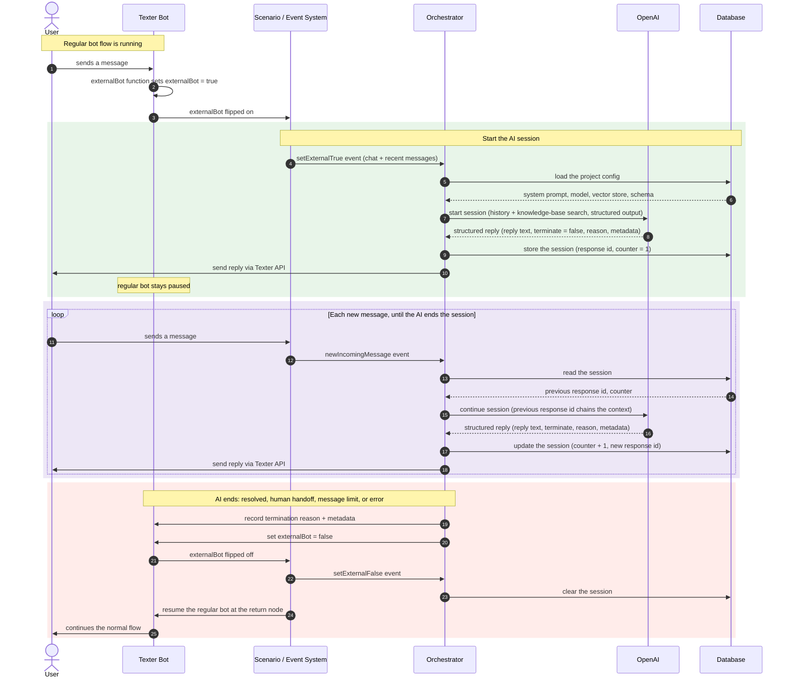

# How It Works

This page follows **one conversation from start to finish**: what happens between a contact sending a message and the assistant's reply appearing, and what decides whether the conversation continues or ends. If you haven't read the **[Overview](/docs/q-ai-bot/overview)** yet, do that first.

---

## Step 1: AI mode, the on/off switch

Every chat carries a master switch: the chat's **`externalBot`** flag (we call it *AI mode* here). While it is **off**, the Q-AI Bot ignores the chat entirely and your normal Texter bot is in control. While it is **on**, every incoming message is sent to the assistant.

A bot flow turns the AI on by setting `externalBot` with the **[externalBot function](/docs/YAML/Types/Func/Chat/External%20Bot)**, at the point where you want the AI to take over (for example, after an earlier step in the flow, or when a test keyword is matched). The Q-AI **scenarios** watch that flag: one starts the AI session the moment it flips on, and others flip it back off automatically (an agent takes the chat, it is resolved, or the assistant decides it is done). The full set of what turns it on and off lives on the **[Conversation Lifecycle](/docs/q-ai-bot/conversation-lifecycle)** page.

---

## Step 2: Turning it on starts a fresh session

The moment AI mode is switched on, a **new AI session** begins for that chat. A session is the assistant's memory of *this* conversation: it starts clean, with no carryover from any previous AI session on the same chat.

At session start the assistant receives the recent chat history and the project's **system prompt**: the per-project standing instructions and persona (so the same platform can host a friendly receptionist for one business and a terse support agent for another). The prompt itself lives in a synced document; see **[Knowledge Files](/docs/q-ai-bot/knowledge-files)**.

### Optional: extra context at session start

A project can also hand the assistant an **extra block of context** at the moment the AI turns on, so it begins already knowing things the message history alone wouldn't tell it.

This is wired into the **Turn On AI Bot** scenario. Alongside the chat and its recent messages, the scenario can attach a `crmData` object to the start event, and that object is folded into the assistant's very first prompt. It is an **open bag of data**: whatever the project decides is useful to know up front. A common setup attaches the contact's labels, their phone number, and the template message they are replying to:

```json
{
  "crmData": {
    "interest": ["adhd-assessment", "returning-customer"],
    "phoneNumber": "+972500000000",
    "initialOutgoingTemplateMessage": "Hi! Thanks for your interest in our ADHD assessment, how can we help?"
  }
}
```

With that in hand, the assistant opens already knowing the person came in from a specific campaign and what was said to them, instead of having to ask. The fields are entirely up to the project: labels, stored values, a CRM lookup, the contact's name or city, the source campaign, anything that helps it respond well from the first message.

:::note[Per project, and open-ended]
There is no fixed schema for this context block. Each project decides what to include, and Texter support wires it into that project's Turn On AI Bot scenario. Add only what genuinely helps the assistant: more context means a longer prompt (and slightly higher per-turn cost).
:::

---

## Step 3: Each incoming message is one AI turn

After the session starts, the rule is simple: **one incoming message = one AI turn.** A single turn looks like this:

1. **Receive** the contact's message.
2. **Retrieve**: the assistant searches the project's **[knowledge base](/docs/q-ai-bot/knowledge-base)** for relevant snippets (the RAG step). It only does this when the question calls for it.
3. **Reason**: it combines the question, the retrieved snippets, the system prompt, and the conversation so far, then composes an answer.
4. **Respond**: it returns a **[structured reply](/docs/q-ai-bot/response-schema)** (see Step 4).

The retrieval step is the only optional one: if the question doesn't need the knowledge base (a greeting, a "thanks"), the assistant skips straight to reasoning.

---

## Step 4: The structured reply

Every turn produces a **structured reply** with a few fields: the **visible message**, a signal for whether the session should **end**, a **reason** if it ends, and some internal **metadata** (a short summary and the assistant's reasoning, plus any extra fields the project's schema defines).

Only the visible message is sent to the contact. The other fields let Texter act on the assistant's decisions automatically (end the session for *this* reason, route the bot down the right path) and populate reports. The exact shape, and how the bot YAML reads it, is documented on the **[Response Schema](/docs/q-ai-bot/response-schema)** page.

---

## Step 5: Routing after each turn

Once the visible reply is sent, Texter decides what happens next based on the structured reply and the session's state:

| Outcome | What happens |
| --- | --- |
| **Continue** | The session stays open and waits for the contact's next message, which becomes the next AI turn. |
| **Message limit reached** | The session hits the project's per-session turn cap and ends so it can't loop forever (set in **[Per-Project Settings](/docs/q-ai-bot/per-project-settings)**). |
| **End** | The assistant signalled it is finished: either it resolved the chat, or it asked for a human. The session ends and the chat is handed off. |

If anything goes wrong during a turn (for example the assistant call fails), the session also ends safely so the contact is never left talking to a stalled bot.

---

## Step 6: Handing back to a human

When a session ends, AI mode switches **off** and a **termination reason** is recorded on the chat so your bot (and your reports) know *why* the AI stepped away. Your Texter bot then branches on that reason: route a human handoff to an agent, label the chat, update your CRM, or send a closing message. The handoff mechanics and the full list of end reasons are on the **[Conversation Lifecycle](/docs/q-ai-bot/conversation-lifecycle)** page.

---

## What makes it feel continuous

A contact experiences one smooth conversation, even though each turn is a separate run. That continuity is kept **server-side**: the reasoning model (see **[RAG & OpenAI Concepts](/docs/q-ai-bot/rag-and-openai-concepts)**) holds the thread of the conversation for the life of the session, so the assistant never forgets what was said two messages ago and Texter does not have to resend the whole history each time. When the session ends, that memory is released.

:::note[One session, one memory]
Continuity is per session, intentionally: it keeps a re-engaged or re-opened conversation from being polluted by stale context.
:::

---

## The full flow, end to end

The diagram below traces a complete conversation across every part of the system: the Texter bot hands off, the AI loop runs turn after turn, and the chat returns to the bot when the assistant is done. The [scenarios](/docs/q-ai-bot/conversation-lifecycle) emit three webhook events along the way (`setExternalTrue`, `newIncomingMessage`, `setExternalFalse`); the AI side is the **AI Assistant - Main** automation.


