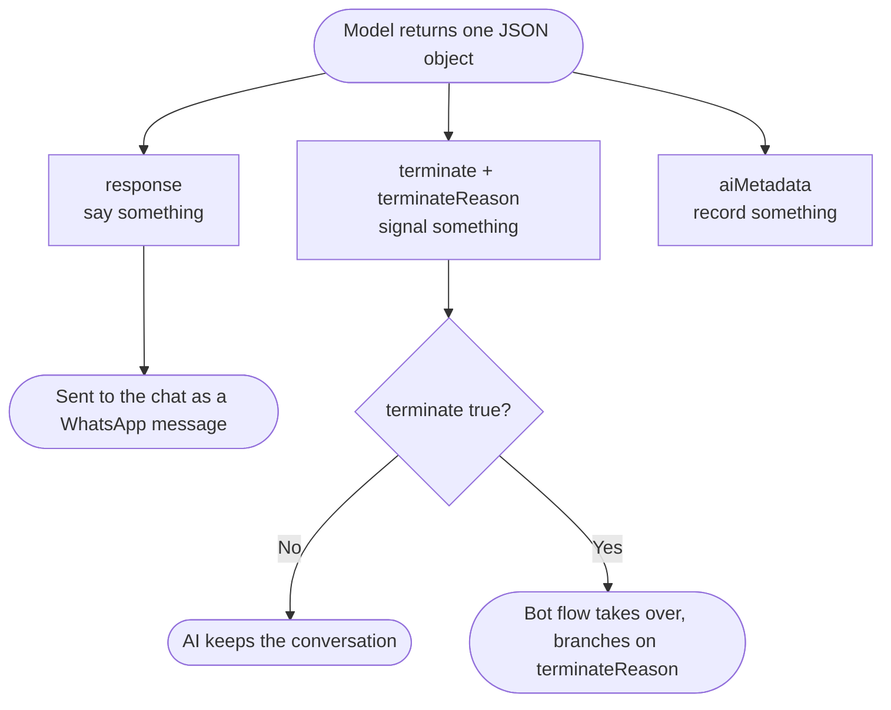

# Response Schema

Every time the Q-AI Bot thinks, it does **not** hand back a paragraph of free text. It hands back a single **JSON object with a fixed shape**. That object is the contract between the AI and the Texter platform: one field becomes the message the contact reads, other fields tell the bot flow what to do next, and a hidden block carries analytics. This page explains that object — field by field — and shows how your bot YAML reads it, routes on it, and extends it.

If you are new to the Q-AI Bot, read the [Q-AI Bot overview](/docs/q-ai-bot/overview) first; this page assumes you already know that the AI runs alongside a Texter bot and is switched on and off by [scenarios](/docs/q-ai-bot/conversation-lifecycle).

:::note[How to read this page]
Sections 1–4 cover the **default schema** every project starts with — the reply, the control channel, and how your bot YAML reads them. That is all most projects ever need. Sections 5–8 are **advanced and optional**: custom exit reasons, configurable messages, and an extended schema for lead capture. Skip them on a first read and come back when a project actually needs them.
:::

---

## 1. Why structured output

A chatbot that returns plain text can only do one thing: send that text. It cannot reliably tell the surrounding system *"now hand this chat to a human"* or *"this person is a hot lead, tag them"* — because there is no dependable place to put that signal. Parsing intent out of prose is fragile and breaks the moment the model rephrases itself.

The Q-AI Bot avoids this entirely. The model is constrained to return a **structured response**: a JSON object whose keys are known in advance. The reply to the contact lives in one field; the control signals live in their own fields; the analytics live in a separate block the contact never sees. The platform reads each field by name and acts on it deterministically.



This split — **say something, signal something, record something** — is the core idea of the whole feature. Everything below builds on it.

---

## 2. The default schema

This is the **actual default schema** the Q-AI Bot uses out of the box. It is a JSON Schema definition: it tells the OpenAI Responses API exactly what shape the model's answer must take, and the API guarantees the model's output validates against it.

```json
{
  "name": "Agent_Response",
  "strict": true,
  "schema": {
    "type": "object",
    "additionalProperties": false,
    "required": ["terminate", "terminateReason", "response", "aiMetadata"],
    "properties": {
      "response": { "type": "string", "description": "The reply to be sent to the user, formatted as a plain WhatsApp message." },
      "terminate": { "type": "boolean", "description": "Set to true if the conversation should be terminated; otherwise, false." },
      "terminateReason": { "type": "string", "enum": ["human_handoff", "resolved_convo", "null"], "description": "Reason for terminating the conversation. Set to (null) if terminate is false, otherwise provide the relevant reason for termination." },
      "aiMetadata": { "type": "object", "additionalProperties": false, "required": ["summary", "reasoning"], "description": "Internal metadata used for tagging and analytics. This is not seen by the user.", "properties": {
        "summary": { "type": "string", "description": "A concise, single-sentence summary of the conversation topic conversation or customers request - in Hebrew (a must!)." },
        "reasoning": { "type": "string", "description": "Your reasoning and thought process behind the response, address the user and system message and your tool calls results to explain why you responded the way you did, and if the conversation was terminated here then why." }
      } }
    }
  }
}
```

### What each field is for

| Field | Type | Who sees it | What it does |
| ----- | ---- | ----------- | ------------ |
| `response` | string | **The contact** | The only field the contact ever reads. It is sent to the chat as a plain WhatsApp message, every turn. |
| `terminate` | boolean | Internal | The on/off switch for ending the AI's part of the conversation. `false` = keep going; `true` = the bot flow should take over. |
| `terminateReason` | string (enum) | Internal | *Why* the AI is ending. The bot flow branches on this. When `terminate` is `false`, the model sets it to the literal string `null`. |
| `aiMetadata.summary` | string | Internal | A one-sentence summary of what the conversation was about — **in Hebrew** (the schema requires it). Used for reports and at-a-glance triage. |
| `aiMetadata.reasoning` | string | Internal | The model's own explanation of why it answered the way it did and why it terminated (if it did). Used for evaluation and debugging. |

:::info[`response` is the only thing the contact sees]
`terminate`, `terminateReason`, and the entire `aiMetadata` block are **never** shown to the contact. They are a private control-and-analytics channel between the model and the platform. Only `response` reaches the chat.
:::

### The control channel: `terminate` + `terminateReason`

These two fields work as a pair. `terminate` decides *whether* the AI hands the conversation back; `terminateReason` decides *where it goes next*. While `terminate` is `false`, the AI keeps the conversation and `terminateReason` is the string `null`. When the AI sets `terminate` to `true`, it must give a reason from the enum — and that reason is what your bot flow switches on (see [section 3](#3-how-the-bot-yaml-consumes-it)).

The two default reasons are:

- `human_handoff` — the AI has decided a person should take over (a question it cannot answer, an explicit request for a human, a sensitive situation).
- `resolved_convo` — the AI believes the conversation is genuinely finished and nothing more is needed.

### `aiMetadata`: internal analytics

`aiMetadata` is the bot's "show your work" block. `summary` gives you a quick Hebrew sentence describing the conversation — handy for agents skimming a queue and for the reporting sheets. `reasoning` records *why* the model responded and terminated as it did, which is invaluable when you are evaluating quality or chasing down a surprising answer. Neither field is shown to the contact, but both are available to your bot YAML and to reporting.

The "in Hebrew (a must!)" note on `summary` is a **convention baked into the default schema**, not a platform rule. The default schema was written for Hebrew-speaking projects so that summaries read naturally in the reporting sheets and the agent queue. If you write a custom schema, you set the summary language yourself.

### `strict` mode and `additionalProperties: false`

Two parts of the schema make it trustworthy:

- **`strict: true`** tells the Responses API to *enforce* the schema. The model cannot return malformed JSON or skip a required field — the output is guaranteed to match the shape.
- **`additionalProperties: false`** means the object may contain **only** the keys defined here. The model cannot invent extra fields. Combined with `required`, this means every response has exactly the fields you expect — no more, no fewer.

:::tip[Why this matters for you]
Because the schema is strict, your bot YAML can read `terminateReason` or any `aiMetadata` field with confidence — the field is always present and always the right type. You never have to defend against the AI "forgetting" a field or returning prose.
:::

---

## 3. How the bot YAML consumes it

The platform handles the response in two simple steps, every turn:

1. **It sends `response` to the chat.** As long as the AI is active, whatever is in `response` is delivered to the contact as a WhatsApp message. No YAML is involved in this — it is automatic.
2. **It checks `terminate`.** While `terminate` is `false`, nothing else happens; the AI stays in control. The moment `terminate` is `true`, the AI session ends and the **bot flow takes over**, resuming at the node configured in your `externalBot` / re-entry setup.

When the bot flow resumes, the terminate reason is available to read. In a Q-AI bot this is exposed as `%chat:crmData.aiTerminateReason%`. Your flow's job is to **branch on it** and route to the right place. The natural tool for this is the [Switch Node](/docs/YAML/Types/Func/System/Switch%20Node).

```yaml
  back_to_texter:
    type: func
    func_type: system
    func_id: switchNode
    params:
      input: "%chat:crmData.aiTerminateReason%"
      cases:
        "human_handoff": ai_handoff_message
        "resolved_convo": ai_resolved_message
    on_complete: ai_handoff_message
```

Here, when the AI ends with `human_handoff`, the flow routes to a node that posts your handoff message and hands the chat to an agent; when it ends with `resolved_convo`, it routes to a polite closing node. The `on_complete` fallback catches anything unexpected. (Case keys are matched as **strings** and must be quoted — see the [Switch Node](/docs/YAML/Types/Func/System/Switch%20Node) page.)

:::note
The exact node names and the field you read (`%chat:crmData.aiTerminateReason%`) come from the [AI Bot recipe](/docs/YAML/Bot%20Recipes/AI%20Bot). Use that recipe as your starting scaffold rather than wiring this from scratch.
:::

---

## 4. Routing with `aiMetadata`

The terminate fields are not the only thing the bot can act on. **Any field inside `aiMetadata` is readable in your bot YAML**, which means the AI can pass structured signals down into the flow and your flow can react to them — add a label, branch, or feed the value into an update step.

For example, you can add a label to the chat based on a metadata value using the [Labels](/docs/YAML/Types/Func/Chat/Add%20Label) function:

```yaml
  label_from_ai:
    type: func
    func_type: chat
    func_id: labels
    params:
      add:
        - "%chat:crmData.aiMetadata.classification%"
    on_complete: back_to_texter
```

Or you can branch the flow on a metadata value with a [Switch Node](/docs/YAML/Types/Func/System/Switch%20Node):

```yaml
  route_by_classification:
    type: func
    func_type: system
    func_id: switchNode
    params:
      input: "%chat:crmData.aiMetadata.classification%"
      cases:
        "HOT": hot_lead_handoff
        "WARM": warm_lead_nurture
        "COLD": cold_lead_close
    on_complete: warm_lead_nurture
```

You can also persist a metadata value into the session store with [Store Value](/docs/YAML/Types/Func/System/Store%20Value) so later nodes can reuse it, or map several fields into a CRM update step. The pattern is always the same: the AI writes a structured field, the YAML reads it by path.

:::tip
The default schema only defines `summary` and `reasoning` under `aiMetadata`. To route on `classification` (as above) you must first **add that field to the schema** — see [section 7](#7-an-advanced-schema-lead-capture). Reading a field the schema never defines will simply yield an empty value.
:::

---

## 5. Custom terminate reasons

The default `terminateReason` enum has two values, but it is **not fixed**. You can extend the enum with your own reasons, and the AI will choose among them when it ends a conversation. This turns `terminateReason` into a steering wheel: the AI decides *where in the bot flow the conversation should land* after it bows out, and your post-AI flow routes each reason to a different node.

For example, suppose you want the AI to be able to end by sending a pricing-qualified lead straight to a booking branch. Add a custom reason to the enum:

```json
"terminateReason": {
  "type": "string",
  "enum": ["human_handoff", "resolved_convo", "ready_to_book"],
  "description": "Reason for terminating. Use 'ready_to_book' when the contact has confirmed they want to schedule."
}
```

Then add a matching branch to the switch that runs after the AI ends:

```yaml
  back_to_texter:
    type: func
    func_type: system
    func_id: switchNode
    params:
      input: "%chat:crmData.aiTerminateReason%"
      cases:
        "human_handoff": ai_handoff_message
        "resolved_convo": ai_resolved_message
        "ready_to_book": booking_flow_start
    on_complete: ai_handoff_message
```

Now, whenever the AI decides a contact is ready to schedule, it terminates with `ready_to_book`, the flow catches that case, and the contact drops directly into your booking branch. You have effectively given the AI a new "exit door" into the bot.

:::caution[Keep the schema and the flow in sync]
Every reason in the enum should have a matching `case` in the post-AI switch, and the switch's `on_complete` fallback should point somewhere sensible for reasons you have not branched yet. If you add an enum value but forget the branch, the conversation falls through to the fallback node.
:::

---

## 6. The messages you configure in YAML

A key thing to understand: **the human-facing messages around the AI live in the bot YAML, not in the AI.** The AI writes the conversational replies (`response`); the bot flow owns the scripted, transactional messages that frame the AI's start and end. This keeps wording consistent and under your control.

These are the messages you typically configure in the flow:

| Message | When it fires | Purpose |
| ------- | ------------- | ------- |
| **Handoff / "we got your details"** | The AI ends with `human_handoff` | Reassures the contact that a person will follow up, before the chat moves to an agent. |
| **Inactivity / re-engagement closing** | The [re-engagement ladder](/docs/q-ai-bot/abandoned-bot-system) gives up after the contact stops replying | A graceful sign-off so an abandoned conversation closes politely. |
| **Message-limit** | The conversation reaches its configured turn limit | Lets the contact know the automated portion is wrapping up and what happens next. |
| **Error / apology** | The AI run fails for any reason | A short apology and a safe fallback (usually a handoff) so a glitch never leaves the contact in silence. |

Because these live in the flow, you can re-word them per project, localize them, and route them with the same [Switch Node](/docs/YAML/Types/Func/System/Switch%20Node) pattern shown above — typically driven by `terminateReason` and the error/limit signals surfaced by the [scenarios](/docs/q-ai-bot/conversation-lifecycle).

:::info
The AI never sees these messages and never writes them. Keeping the transactional copy in YAML means a non-engineer can adjust the handoff or closing wording without touching the AI configuration.
:::

---

## 7. An advanced schema (lead capture)

The real power of the response schema is that you can **extend `aiMetadata`** to make the AI extract structured data while it talks. Below is a generic lead-capture schema. It adds a lead score, a classification, and a set of extracted contact fields — while leaving the control fields (`response`, `terminate`, `terminateReason`) **exactly as they were**, so all the flow scaffolding from the sections above still works unchanged.

```json
{
  "name": "Agent_Response",
  "strict": true,
  "schema": {
    "type": "object",
    "additionalProperties": false,
    "required": ["terminate", "terminateReason", "response", "aiMetadata"],
    "properties": {
      "response": { "type": "string", "description": "The reply to be sent to the user, formatted as a plain WhatsApp message." },
      "terminate": { "type": "boolean", "description": "Set to true if the conversation should be terminated; otherwise, false." },
      "terminateReason": { "type": "string", "enum": ["human_handoff", "resolved_convo", "null"], "description": "Reason for terminating the conversation. Set to (null) if terminate is false, otherwise provide the relevant reason for termination." },
      "aiMetadata": {
        "type": "object",
        "additionalProperties": false,
        "required": ["summary", "reasoning", "leadScore", "classification", "extracted"],
        "description": "Internal metadata used for tagging, analytics, and lead capture. This is not seen by the user.",
        "properties": {
          "summary": { "type": "string", "description": "A concise, single-sentence summary of the conversation - in Hebrew (a must!)." },
          "reasoning": { "type": "string", "description": "Your reasoning behind the response and any termination." },
          "leadScore": { "type": "integer", "minimum": 0, "maximum": 10, "description": "How qualified the lead is, from 0 (not a lead) to 10 (ready to buy)." },
          "classification": { "type": "string", "enum": ["HOT", "WARM", "COLD"], "description": "Overall lead temperature." },
          "extracted": {
            "type": "object",
            "additionalProperties": false,
            "required": ["firstName", "lastName", "phone", "email", "city", "services"],
            "description": "Contact details the assistant extracted from the conversation. Use an empty string when a value was not provided.",
            "properties": {
              "firstName": { "type": "string" },
              "lastName": { "type": "string" },
              "phone": { "type": "string" },
              "email": { "type": "string" },
              "city": { "type": "string" },
              "services": { "type": "array", "items": { "type": "string" }, "description": "Services or products the contact expressed interest in." }
            }
          }
        }
      }
    }
  }
}
```

Notice that everything outside `aiMetadata` is identical to the default. The same `terminate` / `terminateReason` control channel, the same `back_to_texter` switch — none of it changes. You have only taught the model to **also** report a score, a temperature, and extracted fields alongside its reply.

:::tip
Keep `extracted` fields generic and let the model write an empty string when a value is missing (the `required` list still forces the field to exist, which keeps the object shape stable for your YAML to read).
:::

---

## 8. Lead scoring

With the advanced schema in place, the AI does double duty: it answers the contact **and** scores them. On each turn it can update `leadScore` and `classification` inside `aiMetadata` based on what the contact has said so far. Your bot flow then reacts to those values exactly like any other metadata:

- **Label** a chat `HOT` / `WARM` / `COLD` with the [Labels](/docs/YAML/Types/Func/Chat/Add%20Label) function so agents can sort the queue.
- **Route** the flow on `classification` (the switch in [section 4](#4-routing-with-aimetadata)) so a hot lead goes straight to a human while a cold one gets a polite close.
- **Hand off** immediately when `leadScore` crosses a threshold you care about, instead of waiting for the contact to ask.

This is lead scoring in practice — the [advanced schema](#7-an-advanced-schema-lead-capture) gives the AI the `leadScore` and `classification` fields, the AI does the judging inside the structured response, and the deterministic bot flow does the acting.

---

## 9. Testing

The fastest way to see the schema end to end is the **[AI Bot recipe](/docs/YAML/Bot%20Recipes/AI%20Bot)**. It is a minimal, paste-in bot snippet that turns the AI on via the `AI_TEST` keyword, runs a real conversation through the AI, and includes the `back_to_texter` switch that branches on `terminateReason`. Drive a few messages through it, end the conversation, and watch the flow route on the reason the AI returned. Once that loop works, layer in your `aiMetadata` routing and any custom terminate reasons.

See the [scenarios](/docs/q-ai-bot/conversation-lifecycle) page for how the AI is switched on and off around this flow.

---

## 10. Where it is configured

The response schema is stored **per project in the managed configuration database** and is owned by engineering. The flow is one-directional: the schema lives in the database, the AI returns JSON that matches it, and the bot YAML reads `response`, `terminateReason`, and `aiMetadata` from that JSON. The schema is **not** edited in the public bot YAML — the YAML only *consumes* what the schema produces.

:::caution[Schema changes must be coordinated]
The schema and the bot flow that reads it are **two halves of one contract**. If you add a `terminateReason` value, a new `aiMetadata` field, or rename anything, the YAML that reads it must change too — and vice versa. Always coordinate a schema change with the flow update so a new field has somewhere to go and an old `case` never points at a node that disappeared.
:::

---

## Related pages

- [Q-AI Bot overview](/docs/q-ai-bot/overview) — what the feature is and how the pieces fit together.
- [Scenarios](/docs/q-ai-bot/conversation-lifecycle) — how the AI is switched on and off around the bot flow.
- [Re-engagement ladder](/docs/q-ai-bot/abandoned-bot-system) — the inactivity behavior behind the closing message.
- [AI Bot recipe](/docs/YAML/Bot%20Recipes/AI%20Bot) — the paste-in scaffold for testing.
- [Switch Node](/docs/YAML/Types/Func/System/Switch%20Node) · [Labels](/docs/YAML/Types/Func/Chat/Add%20Label) · [Store Value](/docs/YAML/Types/Func/System/Store%20Value) — the YAML functions that read the schema.
