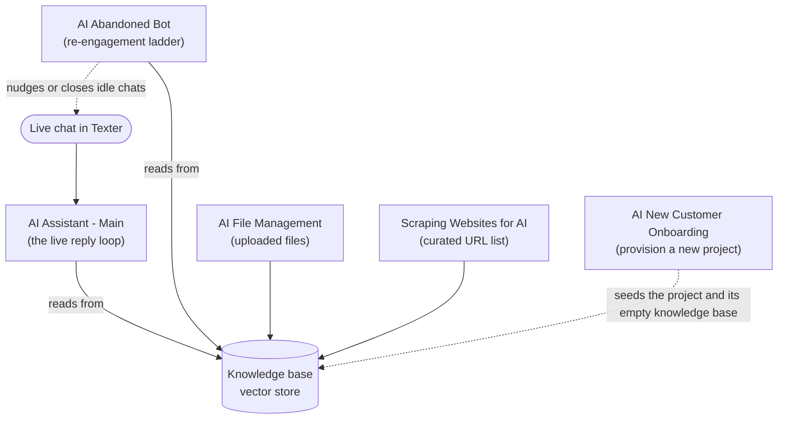

# Workflows & Automations

The Q-AI Bot is a set of **named background automation workflows**, each with one job — together they carry a chat from "AI turned on" to "handed back to a human" and keep each project's knowledge base fresh. This page is the roster: what each workflow does and where its behavior is documented in full. Refer back when a teammate mentions one by name.

---

## How the workflows fit together

At a high level there are two clocks ticking:

- **The conversation clock** — driven by chat events. When a chat turns the AI on, sends a message, or gets handed back to a human, a workflow reacts in real time.
- **The knowledge clock** — driven by schedules and file changes. In the background, other workflows keep each project's knowledge base in sync so the AI always answers from current information.

---

## Conversation workflows

These react to live chat events. They are the part of the system a support hire will think about most.

### AI Assistant - Main

The **core reply loop** — the workflow that does the actual answering. It calls the model (with knowledge-base search), reads the structured answer, replies into the chat, and decides what happens next (continue, limit, or hand back). It also keeps each conversation's context so the AI "remembers" earlier turns without resending the whole history.

See **[How It Works](/docs/q-ai-bot/how-it-works)** for a turn-by-turn walkthrough and **[Conversation Lifecycle](/docs/q-ai-bot/conversation-lifecycle)** for how a chat starts, continues, and ends.

### AI Assistant - Dev Sandbox

The **safe twin** of *AI Assistant - Main*: the same job, used to trial changes before they go live so new behavior is validated without touching real conversations. It also writes each test turn into an **evaluation report**, making it a natural place to check answer quality.

See **[Reporting & Evaluation](/docs/q-ai-bot/reporting)** for what gets logged during these test runs.

### AI Abandoned Bot

Handles **idle conversations**. When someone stops replying mid-conversation, this workflow walks a per-project **re-engagement ladder** of timed steps that can send a reminder, an AI-written nudge, or eventually close the session and hand back to the normal Texter bot.

See **[Abandoned Bot System](/docs/q-ai-bot/abandoned-bot-system)** for the full ladder mechanics.

---

## Knowledge workflows

These keep each project's knowledge base current. The AI reads from this knowledge base when it answers, so these workflows are what make the answers accurate and up to date.

### AI File Management

Keeps the knowledge base in sync with the **files** a project provides. When a knowledge file is added, changed, or removed in the project's document folder, this workflow mirrors that change into the AI's searchable knowledge base. It is also the path that updates a project's **system prompt** when the prompt document changes.

See **[Knowledge Files](/docs/q-ai-bot/knowledge-files)** for how files flow into the knowledge base.

### Scraping Websites for AI - Main Loop

Keeps the knowledge base in sync with a project's **website content**. It works from a **curated list of page URLs** (not by crawling the whole site): on a schedule it compares that list against what is stored and decides, per page, whether to add, refresh, or remove it — then hands each page to one of three small helpers (**Create One Page**, **Update One Page**, **Delete One Page**).

See **[Website Scraping](/docs/q-ai-bot/website-scraping)** for the full mechanism and the per-page helpers.

---

## Setup & insight workflows

These run around the edges of a conversation rather than inside it.

### AI New Customer Onboarding

Provisions a **brand-new AI project** end to end — the empty knowledge base, configuration, document folders, default prompt and evaluation report, and the lifecycle scenarios — behind the [Onboard AI Bot](/docs/tools/onboard-ai-bot) tool.

See **[Onboarding a New Project](/docs/q-ai-bot/onboarding)** for what gets provisioned.

### Update AI Report Sheets

A small **logging helper** that *AI Assistant - Main* calls on every turn, in the background. It appends the turn's question, the AI's answer, and the model's reasoning to the project's evaluation report (for a human to score later), and records usage for cost and volume tracking. It is "fire-and-forget": the conversation never waits on it.

See **[Reporting & Evaluation](/docs/q-ai-bot/reporting)** for how the logs are structured and read.

---

## Where to go next

- **[Conversation Lifecycle](/docs/q-ai-bot/conversation-lifecycle)** — how a chat moves through the AI and back to humans, plus the Texter scenarios that wake these workflows up.
- **[Per-Project Settings](/docs/q-ai-bot/per-project-settings)** — the configuration each of these workflows reads.
- **[Scenario Marketplace](/scenarios)** — import the Q-AI scenarios (search `q-ai` or filter the `ai-bot` tag) that trigger the conversation workflows.
