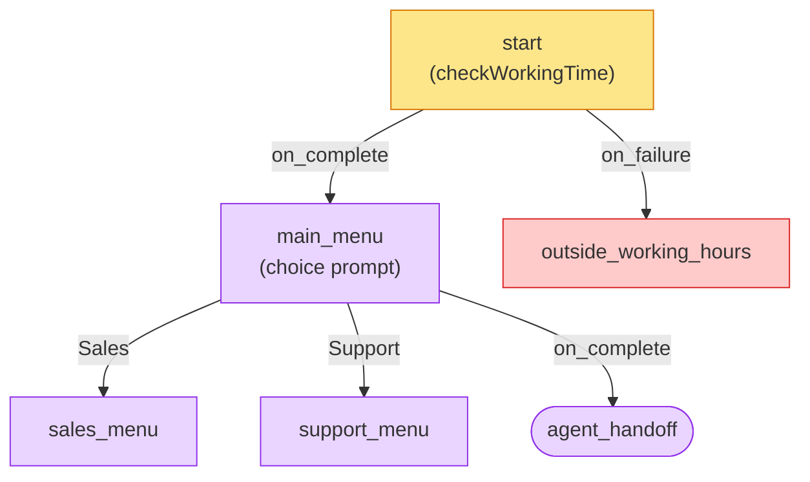

# YAML Overview

A Texter bot is defined by a single YAML file. The file describes **who the bot is**, **how it behaves**, and **what nodes (steps) the conversation flows through**.

---

## Structure of a bot YAML

Every bot file has two main sections: **bot-level configuration** (top of the file) and **nodes** (the conversation steps).

```yaml
identifier: whatsper-bot
start_node: start
apiVersion: v1.1

working_time:
  office:
    sun-thu: 08:00-17:00

prompt_retries: 2

pending_message:
  text: "We received your message and will reply shortly."
  everyMins: 5

abandoned_bot_settings:
  first_retry:
    timeout: 7
    text:
      - "Hi, I'm waiting for your response 😊"
  abandoned:
    timeout: 12
    node: abandoned_bot_sequence_1

smart_resolved:
  node: smart_resolved

nodes:
  start:
    type: func
    func_type: system
    func_id: checkWorkingTime
    on_complete: main_menu
    on_failure: outside_working_hours

  main_menu:
    type: prompt
    prompt_type: choice
    interactive: buttons
    messages:
      - "How can we help?"
    choices:
      - title: "Sales"
        on_select: sales_menu
      - title: "Support"
        on_select: support_menu
    on_complete: agent_handoff
```

---

## Node types

Every node has a `type` field that determines what it does:

| Type            | Purpose                                           |
| --------------- | ------------------------------------------------- |
| `prompt`        | Sends a message and **waits** for user input      |
| `notify`        | Sends a message **without** waiting for input     |
| `func`          | Executes a function (system, CRM, chat, or utils) |
| `whatsapp:flow` | Launches an interactive WhatsApp Flow form        |

---

## How nodes connect

Nodes route to each other using these fields:

| Field         | When it fires                                                                             |
| ------------- | ----------------------------------------------------------------------------------------- |
| `on_complete` | After the node finishes successfully                                                      |
| `on_failure`  | When the node fails (e.g., outside working hours, CRM lookup miss, user exceeded retries) |
| `on_select`   | When a specific choice is selected (inside `choices`)                                     |

The value of each routing field is the **name of another node** in the same YAML file, or a built-in action like `handoff` or `resolved`.

Here's how the example bot above flows:



### Built-in actions

| Action     | What it does                                                 |
| ---------- | ------------------------------------------------------------ |
| `handoff`  | Transfers the chat to a human agent (sets status to PENDING) |
| `resolved` | Marks the chat as resolved/closed                            |

:::danger
You can't use the built-in actions as the value of an `on_failure` field - you must route to another node.

If you must, use a **[noop func node](./Types/Func/System/Noop)** with `on_complete: resolved` field.
:::

---

## Common node fields

These optional fields can be added to **any** node type (`notify`, `prompt`, `func`, `whatsapp:flow`):

| Field        | Type    | Description                                                                                                                                                                                                                                                                  |
| ------------ | ------- | ---------------------------------------------------------------------------------------------------------------------------------------------------------------------------------------------------------------------------------------------------------------------------- |
| `title`      | string  | A human-readable display name for the node. Appears in Texter's UI when selecting nodes (e.g., in template reply "go to branch" selections and resolve-and-go-to-bot dropdowns)                                                                                              |
| `startable`  | boolean | Marks whether this node can be used as an entry point. Only nodes with `startable: true` appear in Texter's branch selection lists (resolve & go to bot, template reply "go to branch"). Useful for bots with many branches where you only want to show relevant entry nodes |
| `department` | string  | Assigns the chat to a department when this node executes                                                                                                                                                                                                                     |
| `agent`      | string  | Assigns the chat to a specific agent (email address or CRM ID as defined in the Texter agents manager)                                                                                                                                                                       |

```yaml
main_menu:
  title: "Main Menu"
  startable: true
  type: prompt
  prompt_type: choice
  messages:
    - "How can we help?"
  choices:
    - title: "Sales"
      on_select: sales_menu
    - title: "Support"
      on_select: support_menu
  on_failure: agent_handoff
```

:::tip
If your bot has many branches, use `startable: true` only on the entry nodes you want agents to see in the branch selection lists. Nodes without `startable` (or with `startable: false`) won't appear there.
:::

---

## Func nodes

Func nodes execute logic. They are further categorized by `func_type`:

| func_type    | Purpose                              | Example func_ids                                                                                                                                                                                             |
| ------------ | ------------------------------------ | ------------------------------------------------------------------------------------------------------------------------------------------------------------------------------------------------------------ |
| `system`     | Built-in system functions            | `switchNode`, `botStateSplit`, `storeValue`, `request`, `sendWebhook`, `checkWorkingTime`, `keywordsRoute`, `matchExpression`, `sendEmail`, `formatDate`, `noop`, `shareFile`, `setLanguage`, `parseCrmData` |
| `crm`        | CRM adapter operations               | `getCustomerDetails`, `newOpportunity`, `updateLead`, `updateRecord`                                                                                                                                         |
| `chat`       | Chat-level operations                | `labels`, `externalBot`, `sensitiveSession`, `updateCrmData` (see [Update CRM Data](./Types/Func/Chat/Update%20CRM%20Data))                                                                                                                                                  |
| `utils`      | Utility functions                    | `randomCode`, `matchValues`                                                                                                                                                                                  |
| `dataStorage` | Customer-scoped keyed JSON store (TTL, tags) | `getData`, `setData`, `listData`, `deleteData` — see [Data Storage overview](./Types/Func/Data%20Storage/Overview) |
| `department` | Department-level working hours check | `checkWorkingTime`                                                                                                                                                                                           |

---

## Data injection

You can inject dynamic data into any string value using the `%provider:path%` syntax:

```yaml
messages:
  - "Hello %chat:title%, how can we help?"
```

Providers include `chat`, `state`, `messages`, and `time`. You can also pipe data through transformers:

```yaml
value: '%chat:phone|formatPhone("smart","IL")%'
```

See the [Data Injection](./Data%20Injection/Overview) section for full details.
