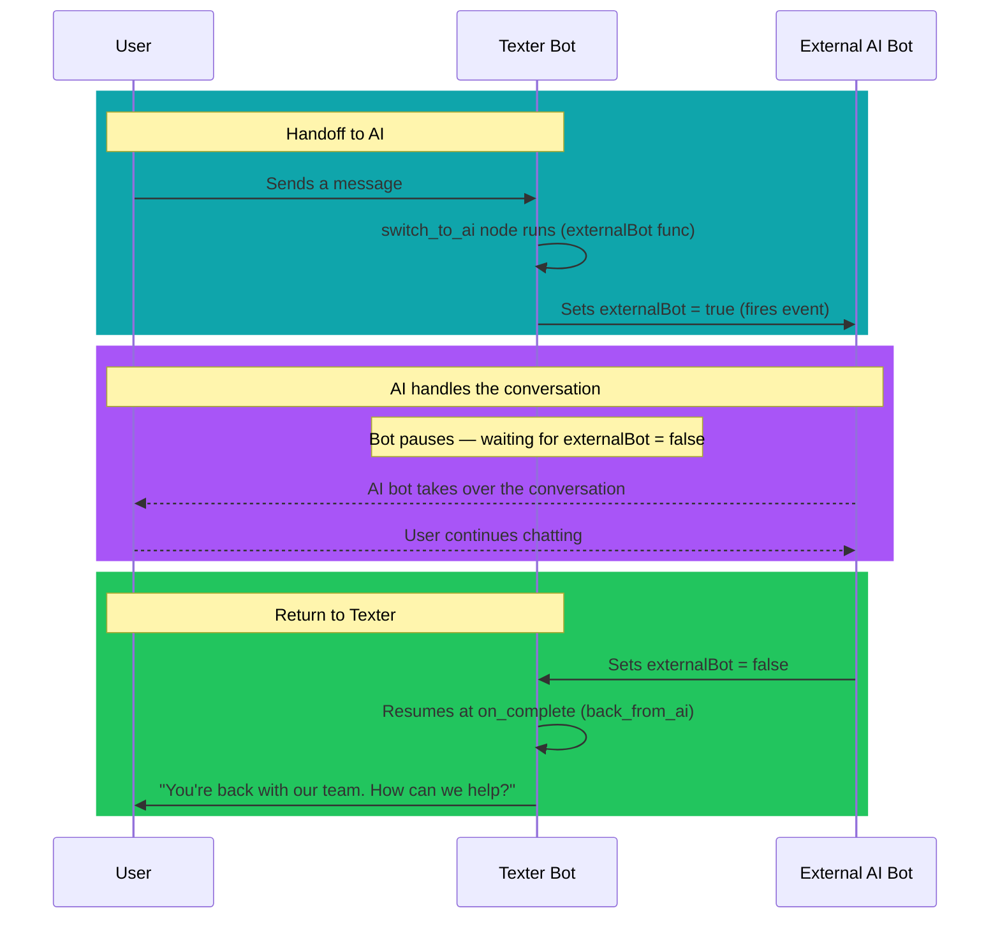

# External Bot

### What does it do?
Toggles the `externalBot` field on the chat object (which is `false` by default). When this node runs, it sets `externalBot` to `true` and fires an event that can trigger external scenarios or webhooks — most commonly used to **hand off to an AI bot**.

The node then pauses the bot flow. When the external service sets `externalBot` back to `false`, control returns to the Texter bot at the node specified in `on_complete`.

___
## 1. Syntax
```yaml
  <node_name>:
    type: func
    func_type: chat
    func_id: externalBot
    on_complete: <next_node>
```

### required params
- `type` type of the node
- `func_type` here it will be a chat function
- `func_id` what function are we calling (`externalBot`)
- `on_complete` node to go to when `externalBot` is set back to `false` (the bot resumes from here)

### optional params
- `on_failure` fallback node
- `department` assigns the chat to a department
- `agent` assigns the chat to a specific agent (email address or CRM ID as defined in the Texter agents manager)

___
## 2. Examples

### Hand off to AI bot, then return
```yaml
  switch_to_ai:
    type: func
    func_type: chat
    func_id: externalBot
    on_complete: back_from_ai
```

### Full flow — AI bot handoff and return
```yaml
  switch_to_ai:
    type: func
    func_type: chat
    func_id: externalBot
    on_complete: back_from_ai

  back_from_ai:
    type: notify
    messages:
      - "You're back with our team. How can we help?"
    on_complete: main_menu
```

:::tip
No params are needed — the function automatically toggles the `externalBot` flag. External integrations (AI bots, automation scenarios, webhooks) listen for this change to activate. When they're done, they set `externalBot` back to `false`, which triggers the `on_complete` node.
:::


