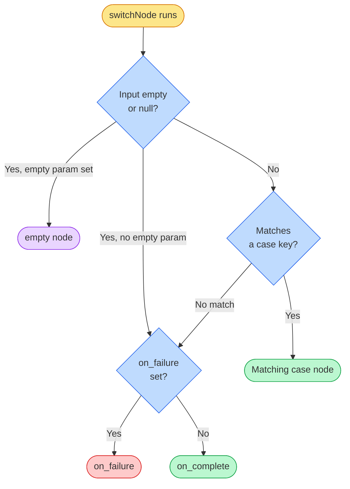

# Switch Node

### What does it do?
Routes to different nodes based on the value of an input. Works like a switch/case statement — checks the input against a list of cases and routes to the matching node. The input is converted to a string and trimmed before matching.
___
## 1. Syntax
```yaml
  <node_name>:
    type: func
    func_type: system
    func_id: switchNode
    params:
      input: "<value to check>"
      cases:
        "<case_1>": <node_for_case_1>
        "<case_2>": <node_for_case_2>
      empty: <node_when_input_is_empty>
    on_complete: <fallback_when_no_case_matches>
```

### required params
- `type` type of the node
- `func_type` here it will be a system function
- `func_id` what function are we calling (`switchNode`)
- `params.input` the value to evaluate — typically a data injection expression (converted to a string and trimmed before matching)
- `params.cases` key-value map where keys are the possible values and values are node names to route to (minimum 1 entry)
- `on_complete` required on every `func` node (YAML validation). For `switchNode`, it is also the **fallback** when there is no `on_failure` (see below)

### optional params
- `on_failure` if set, used as the **fallback** when no case matches (or when input is empty/falsy and `empty` is not set). If omitted, `on_complete` is used for those cases — so for routing purposes, `on_failure` and `on_complete` play the same role; **`on_failure` wins when both are present**
- `params.empty` node to route to when the input is empty, null, or undefined (if omitted, empty input uses the same fallback as a non-matching value)
- `department` assigns the chat to a department
- `agent` assigns the chat to a specific agent (email address or CRM ID as defined in the Texter agents manager)

### Routing logic
1. If input is empty/falsy → routes to `empty` if set, otherwise the fallback (`on_failure` if set, else `on_complete`)
2. If input matches a case key → routes to that case's node
3. If input doesn't match any case → routes to the fallback (`on_failure` if set, else `on_complete`)



___
## 2. Examples

### Route by stored customer type
```yaml
  abandoned_switch_on_customer_type:
    type: func
    func_type: system
    func_id: switchNode
    params:
      input: "%state:store.customer.type%"
      cases:
        "new": abandoned_store_messages
        "existing": handoff
    on_complete: abandoned_store_messages
```

### Route by account ID (multi-branch routing)
```yaml
  check_account_id:
    type: func
    func_type: system
    func_id: switchNode
    params:
      input: "%chat:channelInfo.accountId%"
      cases:
        "972549947692": store_main_details
        "972545230925": store_midtown_details
        "972587400330": store_ono_details
        "972547344476": store_modiin_details
    on_complete: store_main_details
```

### Route by API response count
```yaml
  check_if_customer_found:
    type: func
    func_type: system
    func_id: switchNode
    params:
      input: "%state:node.get_customer_details.response.total%"
      cases:
        "0": ask_if_customer
    on_complete: store_existing_customer_details
```

### Route by CRM field (boolean)
```yaml
  check_covo_field:
    type: func
    func_type: system
    func_id: switchNode
    params:
      input: "%chat:crmData.queryResult.COVO%"
      cases:
        "true": covo_ask_for_feedback
        "false": noop_resolved
    on_complete: noop_resolved
```

### Route by language
```yaml
  smart_resolved:
    type: func
    func_type: system
    func_id: switchNode
    params:
      input: "%state:store.language%"
      cases:
        "hebrew": smart_resolved_he
        "english": smart_resolved_en
        "russian": smart_resolved_ru
    on_complete: smart_resolved_he
```

### Route by HTTP status code with `empty` fallback
```yaml
  switch_by_value_check_if_failed:
    type: func
    func_type: system
    func_id: switchNode
    params:
      input: "%state:node.start_get_costumer_details.statusCode%"
      cases:
        "404": new_client_menu
      empty: store_value_exist_client
    on_complete: store_value_exist_client
```

### Route by branch ID (from a choice node)
```yaml
  switch_treatment_menu_by_branch:
    type: func
    func_type: system
    func_id: switchNode
    params:
      input: "%state:store.branchId%"
      cases:
        "3": midtown_which_treatment
    on_complete: general_which_treatment
```

### Route by stored lead status with `empty`
```yaml
  check_new_lead:
    type: func
    func_type: system
    func_id: switchNode
    params:
      input: "%state:store.newLead%"
      cases:
        "true": open_lead_handoff
      empty: no_lead_handoff
    on_complete: no_lead_handoff
```

### Prefer `on_failure` for the no-match destination (optional)
When you want the “no case matched” node to be explicit, set `on_failure`. It overrides `on_complete` for that fallback; `on_complete` is still required on the node for validation.

```yaml
  route_by_status:
    type: func
    func_type: system
    func_id: switchNode
    params:
      input: "%state:store.status%"
      cases:
        "active": active_flow
    on_complete: default_flow
    on_failure: default_flow
```

:::tip
Case keys are matched as **strings**. Always quote keys in YAML: `"hebrew": node_name`, not `hebrew: node_name` (unquoted keys can be parsed incorrectly).
:::

:::tip
The input is converted to a string and trimmed before matching. `null`, `undefined`, and empty strings are all treated as empty.
:::
