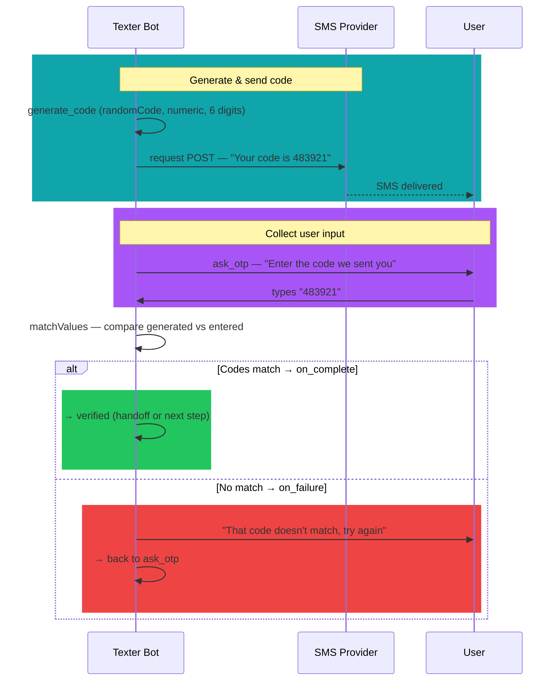

# Match Values

### What does it do?
Compares two string values and routes based on whether they match. If the values are equal → `on_complete`, otherwise → `on_failure`. Primarily used for OTP/code verification — comparing a generated code against what the user entered.
___
## 1. Syntax
```yaml
  <node_name>:
    type: func
    func_type: utils
    func_id: matchValues
    params:
      value: "<expected value>"
      match: "<user input>"
      trim: true
      caseInsensitive: true
    on_complete: <node_if_match>
    on_failure: <node_if_no_match>
```

### required params
- `type` type of the node
- `func_type` here it will be a utils function
- `func_id` what function are we calling (`matchValues`)
- `params.value` the expected/correct value
- `params.match` the value to compare against (typically user input)
- `on_complete` node to go to when values **match**
- `on_failure` node to go to when values **don't match**

### optional params
- `params.trim` if `true`, trims whitespace from both values before comparing
- `params.caseInsensitive` if `true`, converts both values to lowercase before comparing
- `department` assigns the chat to a department
- `agent` assigns the chat to a specific agent (email address or CRM ID as defined in the Texter agents manager)

___
## 2. Examples

### Validate OTP code
```yaml
  validate_otp:
    type: func
    func_type: utils
    func_id: matchValues
    params:
      value: "%state:node.generate_code%"
      match: "%state:node.ask_otp.text%"
      trim: true
    on_complete: handoff_verified
    on_failure: verification_failed
```

### Case-insensitive comparison
```yaml
  check_answer:
    type: func
    func_type: utils
    func_id: matchValues
    params:
      value: "yes"
      match: "%state:node.ask_confirm.text%"
      trim: true
      caseInsensitive: true
    on_complete: confirmed
    on_failure: not_confirmed
```

### Compare two state values
```yaml
  compare_emails:
    type: func
    func_type: utils
    func_id: matchValues
    params:
      value: "%chat:crmData.email%"
      match: "%state:node.ask_email.text%"
      trim: true
      caseInsensitive: true
    on_complete: email_matches
    on_failure: email_mismatch
```

:::tip
Always set `trim: true` to handle accidental whitespace in user input. Use `caseInsensitive: true` when comparing text where casing shouldn't matter (e.g., email addresses, yes/no answers).
:::

___
## Full OTP verification flow

The most common use of `matchValues` — combined with [`randomCode`](../Utils/Random%20Code) and a [`request`](../System/Request) to an SMS provider:


