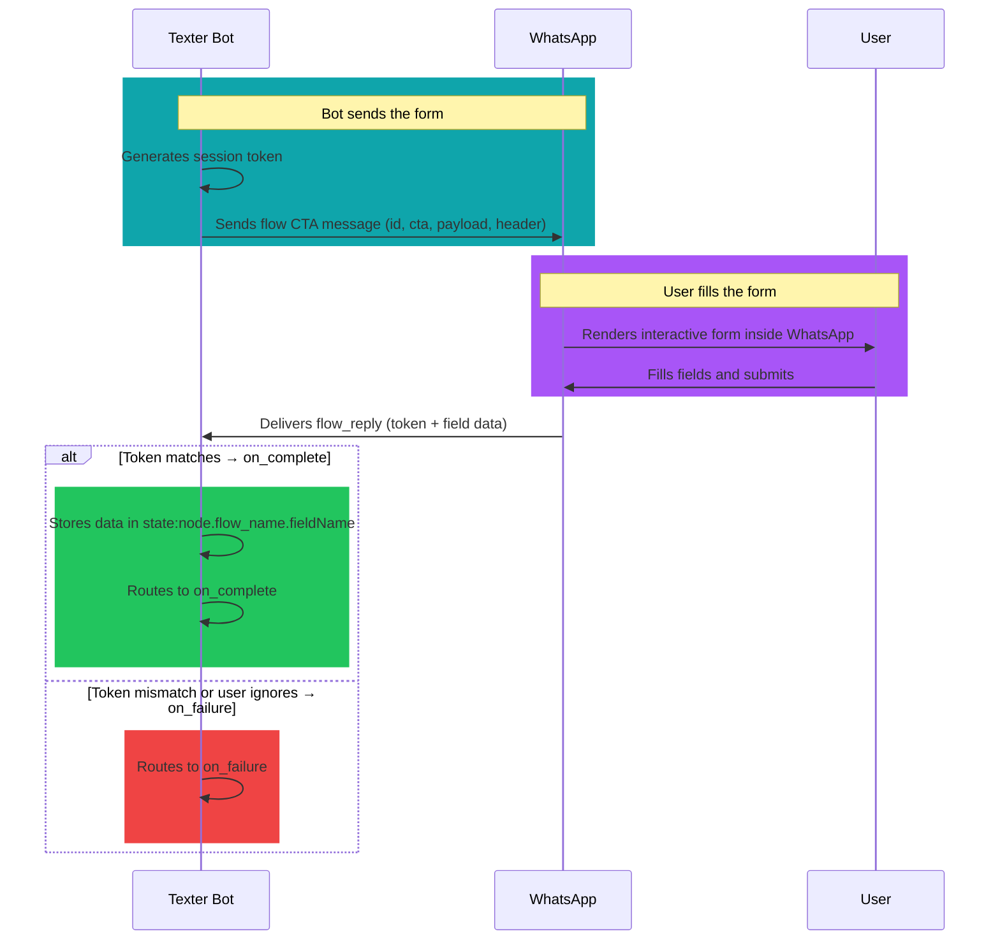

# WhatsApp Flow

### What does it do?
Launches an interactive WhatsApp Flow — a native form/survey inside WhatsApp. The user fills fields (text, dates, dropdowns, etc.) in the app; submitted data is returned to the bot.

___
## 1. Syntax

### Basic shape
```yaml
  <node_name>:
    type: whatsapp:flow
    id: "<flow_id>"
    text: "<message body above the flow button>"
    cta: "<button label, 1–20 characters>"
    on_complete: <next_node>
    on_failure: <fallback_node>
```

### With optional header, footer, mode, action, payload
```yaml
  <node_name>:
    type: whatsapp:flow
    id: "<flow_id>"
    text: "<message body>"
    cta: "<button label>"
    header:
      type: text
      text: "<header line>"
    footer: "<optional footer>"
    mode: published
    action: navigate
    payload:
      screen: "<starting screen id>"
      data:
        some_field: "value"
    on_complete: <next_node>
    on_failure: <fallback_node>
```

### required params
- `type` type of the node (`whatsapp:flow`)
- `id` published Flow ID from WhatsApp Manager — same WABA as the bot (see [Creating flows](#creating-flows-outside-texter))
- `text` message body shown with the flow CTA
- `cta` call-to-action button label (**1–20 characters**, Meta limit)
- `on_complete` next node after a **valid** flow submission (see [How replies work](#how-replies-work))
- `on_failure` fallback if the user does not send a valid flow reply while this node is waiting, or the reply fails validation (wrong token, etc.)

### optional params
- `header` interactive header — **object**, not a plain string:
  - **Text:** `type: text` and `text: "<string>"` (both required)
  - **Media:** `type` one of `image`, `video`, or `document`; `url` required; `filename` optional
- `footer` optional footer string
- `mode` optional — `draft` or `published` (see [Mode](#mode-values))
- `action` optional — `navigate` or `data_exchange` only on this node (see [Action](#action-values))
- `payload` optional object; may include `screen` (string) and/or `data` (object for prefill / initial payload). Shape must match your published flow
- `department` assigns the chat to a department
- `agent` assigns the chat to a specific agent (email address or CRM ID as defined in the Texter agents manager)

:::danger[`payload` is optional in the validator]
The schema allows **no** `payload`, or `payload` without `screen`. In practice many flows still need `payload.screen` (and sometimes `payload.data`). Follow your flow definition from Meta / the playground.

:::

### Mode {#mode-values}

Values match `WhatsApp.Flow.Mode` in code:

| Value | Meaning |
|-------|---------|
| `draft` | Flow is draft / not published; can be sent for **testing** |
| `published` | Flow is published for **production** |


### Action {#action-values}

| Value | Meaning |
|-------|---------|
| `data_exchange` | Sends data to the WhatsApp Flows **data endpoint**; payload is customizable JSON on data exchanges |
| `navigate` | Advances to the **next screen** using the payload as input |

Omit `action` unless your flow requires a specific action when opening the CTA.

___
## 2. Creating flows (outside Texter) {#creating-flows-outside-texter}

There is **no flow builder inside Texter**. Typical workflow:

1. Design the flow (e.g. in the playground below) and implement it in **WhatsApp Manager** / **Meta Business Suite** (often **WhatsApp Manager → Flows**; naming can vary).
2. **Upload and publish** the flow for your business.
3. Copy the **published Flow ID** into the `id` field so the bot can open the flow mid-conversation.

:::tip[Meta Flow playground]
Design flows in Meta’s UI sandbox and export JSON for Business Manager: **[WhatsApp Flows Playground](https://developers.facebook.com/docs/whatsapp/flows/playground)**

:::

:::warning[Same WhatsApp Business Account (WABA)]
The flow must be published on the **same WhatsApp Business Account** the Texter bot uses. If the flow belongs to another account, WhatsApp will not resolve the ID (`id` not found / send fails).

:::

:::tip[API / BSP]
You can also manage flows via the **WhatsApp Cloud API** and BSP tooling (e.g. Tyntec). You still need the **same-account** published `id` in YAML.

:::

___
## 3. How replies work {#how-replies-work}

1. The bot sets the node to **`in_progress`**, generates a **token**, and sends the flow CTA with `id`, `cta`, `mode`, `action`, `payload`, and optional `header` / `footer`.
2. On submit, WhatsApp delivers a **special** message with `flow_reply` containing the **same token** and a **`data`** object (field values).
3. If the token matches and the message is valid, **`flow_reply.data`** is stored in user state under **this node’s name** in the YAML, then the bot goes to **`on_complete`**.
4. If the user sends normal text (or anything that is not a valid flow reply for this token), or the token does not match, the bot goes to **`on_failure`**.

So **`on_failure`** covers wrong replies, ignores, and invalid flow payloads — not only hard errors.



___
## 4. Examples

### Lead capture (text header + footer)
```yaml
  organizations_flow:
    type: whatsapp:flow
    text: "Thank you for reaching out! 👥

      We handle requests for companies and organizations.

      To get back to you with accurate details, please leave us some info."
    cta: "Fill in details"
    id: '889181443546692'
    header:
      type: text
      text: "Company request"
    footer: "Takes about one minute"
    payload:
      screen: 'screen_obpiuo'
    on_complete: get_customer_details_org_flow
    on_failure: organizations_form_failure
```

### Short info form
```yaml
  destination_info_flow:
    type: whatsapp:flow
    text: "To give you the best answer, tell us where and when you're traveling"
    cta: "Fill in details"
    id: '1643413223293188'
    payload:
      screen: 'screen_xsdiph'
    on_complete: update_contact_city_and_dates
    on_failure: destination_form_failure
```

### Prefill with `payload.data`
```yaml
  prefilled_flow:
    type: whatsapp:flow
    text: "Confirm your details below."
    cta: "Open form"
    id: '123456789012345'
    payload:
      screen: 'screen_main'
      data:
        customer_name: "%chat:title%"
        phone: "%chat:channelInfo.id%"
    on_complete: after_flow
    on_failure: flow_cancelled
```

Field names under `data` must match what your published flow expects.

### Satisfaction survey
```yaml
  satisfaction_survey:
    type: whatsapp:flow
    text: "Dear customer,

      We'd appreciate if you could fill out a short survey (2 questions only)
      to help us maintain excellent service. Thank you!"
    cta: "Take the survey"
    id: '842162508565257'
    payload:
      screen: 'screen_vmclpg'
    on_complete: send_survey_results_from_flow
    on_failure: survey_form_failure
```

___
## 5. Accessing flow responses

After a successful submission, `flow_reply.data` is available under the **flow node’s name**. Use data injection with your flow’s field names (flat or nested):

```yaml
%state:node.<flow_node_name>.<fieldName>%
```

Example if `data` includes `companyName`:

```yaml
messages:
  - "Thanks %state:node.organizations_flow.companyName%, we'll be in touch!"
```

___
## 6. Enabling flow responses in the bot

Add this to bot-level `match_messages` so the bot accepts flow submissions:

```yaml
match_messages:
  - type in ("text", "media", "postback")
  - special.whatsapp.flow_reply
```

The second line matches flow reply events.
